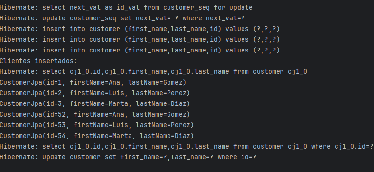

# Proyecto RelationalDataAccessApplication

Aplicación de ejemplo que muestra acceso a bases de datos usando Spring Boot, incluyendo:

- Acceso relacional con **MySQL**, primero con JDBC puro (`JdbcTemplate`) y luego con JPA (`Hibernate`)
- Acceso a base de datos **NoSQL** con **MongoDB** usando Spring Data MongoDB

Todo corre con contenedores Docker para facilitar el entorno de desarrollo.

---

## Descripción

Este proyecto demuestra tres formas comunes de acceder a bases de datos en aplicaciones Java con Spring Boot:

1. **JDBC puro con JdbcTemplate (MySQL):**  
   Ejecución directa de sentencias SQL para crear tablas, insertar datos y hacer consultas relacionales.

2. **JPA con Hibernate (MySQL):**  
   Uso de entidades, repositorios y abstracción ORM para manipular datos relacionales de manera orientada a objetos.

3. **Spring Data MongoDB (MongoDB):**  
   Uso de anotaciones y repositorios para trabajar con documentos de Mongo de forma natural, sin necesidad de sentencias SQL.

Las bases de datos utilizadas (MySQL y MongoDB) corren dentro de contenedores Docker.

---

## Tecnologías

- Java 17+
- Spring Boot 3.x / 4.x
- Spring JDBC (`JdbcTemplate`)
- Spring Data JPA (Hibernate)
- Spring Data MongoDB
- MySQL 8 (Docker)
- MongoDB (Docker)
- Docker Compose

---

## Configuración

### Docker Compose

Archivo `docker-compose.yml` para levantar MySQL:

## yml para mysql
```yaml
version: '3.8'

services:
  mysql:
    image: mysql:8.0
    container_name: mysql-db
    restart: always
    environment:
      MYSQL_ROOT_PASSWORD: rootpassword
      MYSQL_DATABASE: mydatabase
      MYSQL_USER: myuser
      MYSQL_PASSWORD: mypassword
    ports:
      - "3306:3306"
    volumes:
      - mysql_data:/var/lib/mysql

volumes:
  mysql_data:
```

## yml para mongo
```yaml
     mongo:
     image: mongo:6
     container_name: mongo-db
     restart: always
     ports:
        - "27017:27017"
     environment:
        MONGO_INITDB_DATABASE: my_mongo_db
     volumes:
        - mongo_data:/data/db
```


Levanta el contenedor con:

```bash
docker-compose up -d
```


### Configuración Spring Boot (application.yml)
```yaml
spring:
  datasource:
    url: jdbc:mysql://localhost:3306/mydatabase?useSSL=false&allowPublicKeyRetrieval=true&serverTimezone=UTC
    username: myuser
    password: mypassword
    driver-class-name: com.mysql.cj.jdbc.Driver

    jpa:
        hibernate:
        ddl-auto: update
        show-sql: true
        database-platform: org.hibernate.dialect.MySQLDialect
```


### Cómo correr la aplicación
Levanta la base de datos con Docker Compose.

Ejecuta la aplicación:

Primero se ejecuta la lógica con JdbcTemplate para manipulación directa con SQL.

Luego, se puede extender el proyecto para usar JPA con entidades y repositorios.

```bash
./mvnw spring-boot:run
```
                                                
Observa en los logs la creación de tablas, inserción y consultas.

Detalles del proyecto
La clase principal ejecuta el código JDBC puro, crea la tabla customers, inserta datos y consulta registros con JdbcTemplate.


## Uso de JDBC puro con JdbcTemplate

En esta etapa del proyecto, accedemos a la base de datos utilizando **JDBC puro** mediante la clase `JdbcTemplate` de Spring, lo que nos permite ejecutar sentencias SQL directamente.

Las principales tareas que realizamos con JDBC son:

1. **Creación y limpieza de la tabla `customers`:**  
   Ejecutamos sentencias SQL para eliminar la tabla si existe y crearla con las columnas necesarias (`id`, `first_name`, `last_name`).

2. **Inserción masiva de registros:**  
   Preparamos una lista de nombres completos, la separamos en nombre y apellido, y usamos `batchUpdate` para insertar múltiples registros en la tabla de forma eficiente.

3. **Consulta de datos específicos:**  
   Realizamos una consulta para obtener los clientes cuyo `first_name` sea "Josh", mapeando cada fila resultante a un objeto `Customer`.

4. **Visualización de resultados:**  
   Mostramos en los logs los registros obtenidos para verificar que las operaciones se realizaron correctamente.

Este enfoque con JDBC nos da control directo sobre las sentencias SQL y es ideal para operaciones específicas o sencillas.

---


## Uso de JPA con Spring Data JPA

En esta etapa del proyecto, migramos a una forma más orientada a objetos para acceder a la base de datos, utilizando **JPA (Java Persistence API)** con Spring Data JPA y Hibernate como proveedor ORM.

### ¿Qué hacemos con JPA?

1. **Definición de la entidad `CustomerJpa`:**  
   Una clase anotada con `@Entity` que representa la tabla `customers` en la base de datos, con atributos mapeados a columnas (`id`, `firstName`, `lastName`).  
   Importante: debe tener un constructor público vacío para que JPA pueda instanciarla.

2. **Repositorio `CustomerRepository`:**  
   Una interfaz que extiende `JpaRepository<CustomerJpa, Long>` para aprovechar métodos CRUD predefinidos (`save`, `findAll`, `findById`, `delete`, etc.) sin escribir SQL manualmente.

3. **Operaciones CRUD desde el código principal:**
   - Insertar varios clientes usando `save()`.
   - Actualizar un cliente (modificar apellido).
   - Consultar todos los clientes con `findAll()`.
   - Eliminar un cliente con `delete()`.

4. **Inyección de dependencias:**  
   La clase principal usa Spring Boot para arrancar el contexto, inyecta el repositorio y ejecuta las operaciones, mostrando resultados en consola con `System.out.println()`.

---




## Uso de MongoDB con Spring Data

Además de trabajar con bases de datos relacionales, este proyecto también incorpora **MongoDB** como base de datos NoSQL usando **Spring Data MongoDB**.

En esta parte del proyecto:

1. **Creamos una entidad `CustomerMongo`:**  
   Una clase anotada con `@Document` que representa un documento dentro de la colección `customers_mongo`. Incluye campos como `id`, `firstName`, y `lastName`.

2. **Usamos un repositorio Mongo (`CustomerMongoRepository`):**  
   Una interfaz que extiende `MongoRepository`, permitiendo operaciones CRUD automáticas sobre documentos en MongoDB sin necesidad de escribir consultas explícitas.

3. **Guardamos, consultamos y eliminamos documentos:**  
   Desde una clase de prueba o lógica de arranque, realizamos operaciones de:
   - Inserción de documentos
   - Consulta de todos los documentos
   - Búsqueda por campos como `firstName`
   - Eliminación de un documento específico

4. **MongoDB corre en un contenedor Docker:**  
   Se incluye en el `docker-compose.yml` para facilitar la ejecución en local, accesible desde la aplicación Spring.

Este enfoque permite demostrar cómo Spring Boot facilita el acceso a bases de datos tanto relacionales (MySQL) como NoSQL (MongoDB) dentro del mismo proyecto, utilizando una arquitectura desacoplada y extensible.


